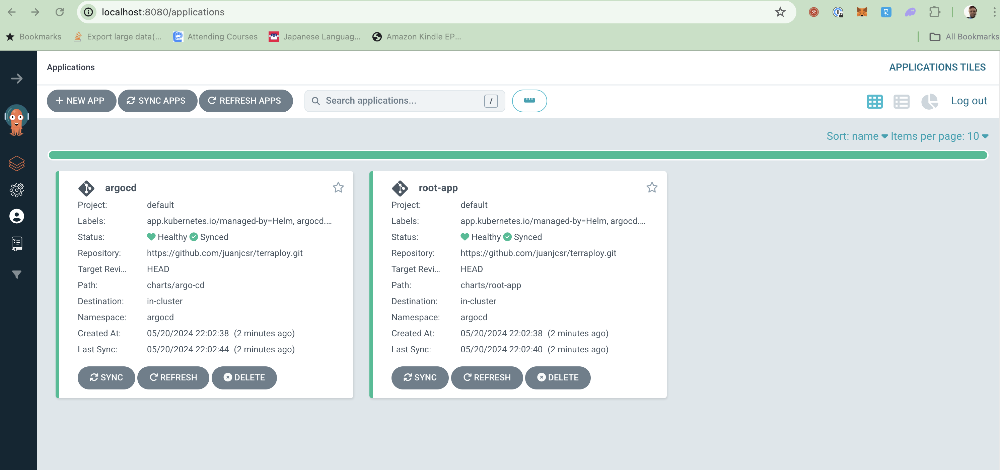

# GitOps pipeline for Kubernetes

# Table of contents

- [Design considerations](#design-considerations)
- [How to run the pipeline](#how-to-run-the-pipeline)
  * [1.1 Requirements to provision the pipeline](#11-requirements-to-provision-the-pipeline)
  * [1.2 Requirements to run the pipeline](#12-requirements-to-run-the-pipeline)
  * [2. Provision the infrastructure and install the gitops pipeline](#2-provision-the-infrastructure-and-install-the-gitops-pipeline)
    + [2.1 Get the gitops configuration](#21-get-the-gitops-configuration)
- [How to add a new app](#how-to-add-a-new-app)
  * [1. Create a new app in ECR via terraform:](#1-create-a-new-app-in-ecr-via-terraform)
  * [2. Create a new app in the gitops repository](#2-create-a-new-app-in-the-gitops-repository)
  * [3. Describe the app in "definition"](#3-describe-the-app-in-definition)
  * [4. Add the app to the gitops pipeline](#4-add-the-app-to-the-gitops-pipeline)
- [Design decisions](#design-decisions)
  * [Tools used](#tools-used)
    + [Why ArgoCD?](#why-argocd)
  * [GitOps repository structure](#gitops-repository-structure)
  * [Pipeline architecture](#pipeline-architecture)

# Design considerations

The goal of this project is to create an automated pipeline that takes a Dockerized application and deploys it to a Kubernetes cluster using GitOps. To automate the pipeline, I used GitHub Actions to build the Docker image and push it to Dockerhub and ECR. I used ArgoCD to deploy the application to the Kubernetes cluster. 

This project is **not** intended to be a production-ready pipeline but rather a proof of concept to demonstrate how to automate provision and deployment of applications to a Kubernetes cluster using GitOps. 

This pipeline is designed to be run in a local minikube cluster. The pipeline provisions the infrastructure using Terraform and deploys the applications to the Kubernetes cluster using ArgoCD. 

The GitOps pipeline is designed to run only in the main branch of the repository. The pipeline is triggered by a change in the `/apps` or `/definition` directories in the GitOps repository. 

# How to run the pipeline

## 1.1 Requirements to provision the pipeline

* Terraform
* A minikube kubernetes cluster 
* A configured AWS account with ECR and IAM permissions

## 1.2 Requirements to run the pipeline

* A GitHub account and a repo (It's currently running in `juanjcsr/terraploy`). 
* A Dockerhub account. By default it's currently pushing to my account https://hub.docker.com/repositories/juanjcsr  
* Github repo configured with the following secrets:
  * `DOCKER_USERNAME`: Dockerhub username
  * `DOCKER_KEY`: Dockerhub password
  * `AWS_ROLE_TO_ASSUME`: The ARN of the OIDC role to assume in the AWS account (the role should have permissions to create ECR repositories ). This role is provisioned after running the terraform pipeline.


## 2. Provision the infrastructure and install the gitops pipeline
```bash
cd terraform
terraform init
terraform apply
```

### 2.1 Get the gitops configuration
```bash
# fetch Argocd password
kubectl -n argocd get secret argocd-initial-admin-secret -o jsonpath="{.data.password}" | base64 -d

# Port forward to the argocd server
kubectl port-forward svc/argocd-server -n argocd 8080:80
```

Access the pipeline at http://localhost:8080




# How to add a new app

## 1. Create a new app in ECR via terraform:

Append to the `terraform/terraform.auto.tfvars` file:
```hcl
ecr_repos_names = [
  "simpleserver",
  "NEW_APP_NAME"
]

```

and apply the changes:
```bash
cd terraform
terraform apply
```

## 2. Create a new app in the gitops repository

Create a new directory in the `/apps` directory with the name of the app and the corresponding Dockerfile

```bash
cd apps
mkdir NEW_APP_NAME

# Create the Dockerfile, example:
echo "FROM python:3.8-slim" > NEW_APP_NAME/Dockerfile
```

## 3. Describe the app in "definition"

Create a new folder in the `/definition` directory with the name of the app and the corresponding `values.yaml` file

```bash 
mkdir -p definition/NEW_APP_NAME
touch values.yaml
```

and describe the app in the `values.yaml` file:

```yaml
appName: NEW_APP_NAME  # The name of the app (required)
namespace: appnamespace # The namespace where the app will be deployed (required)
image:
  repository: juanjcsr/NEW_APP_NAME # The Dockerhub repository where the image will be stored (required)
  tag: latest # The tag of the image (required)

replicas: 1 # The number of replicas of the app

resources: # The resources of the app
  requests:
    cpu: 100m
    memory: 128Mi
  limits:
    cpu: 200m
    memory: 256Mi


```

If you want to enable the service, set `service.enabled` to `true` and describe the service in the `service` section:

```yaml
...
service:
  enabled: true
  type: ClusterIP
  port: 80
  targetPort: 80

```

You can also define limits and requests for the service:

```yaml
...
requests:
  cpu: 100m
  memory: 128Mi
limits:
  cpu: 200m
  memory: 256Mi
```

## 4. Add the app to the gitops pipeline

Commit the changes to the gitops repository and push them to the remote repository:

```bash
git add apps/ definition/

git push origin main
```

The pipeline will automatically deploy the app to the minikube cluster by default


# Design decisions

## Tools used

* Terraform: Infrastructure as code tool used to provision the infrastructure
* ArgoCD: GitOps continuous delivery tool used to deploy the applications to the Kubernetes cluster
* Helm: Package manager for Kubernetes used to define the applications in the GitOps repository
* Minikube: Local Kubernetes cluster used for development and testing
* GitHub Actions: CI tool used to automate the gitops pipeline


### Why ArgoCD?

ArgoCD is a declarative, GitOps continuous delivery tool for Kubernetes. It is a good fit for this project because it allows us to define the desired state of the applications in a Git repository and automatically deploy them to the Kubernetes cluster. It also provides a web interface to manage the applications and the deployments. 

## GitOps repository structure

The GitOps repository is structured as follows:

```
.
├── apps
│   ├── app1
│   │   └── Dockerfile
│   └── ...
├── definition
│   ├── app1
│   │   └── values.yaml
│   └── ...
├── charts
│    └── app1
│        └── Chart.yaml
│        └── templates
│            └── app.yaml
│    └── app2
│        └── ...
│    └── ...
│    └── root-app
│        └── Chart.yaml
│        └── templates
│            └── app1.yaml
│            └── app2.yaml
│            └── argocd.yaml
│            └── root-app.yaml
│    └── defaultapptemplate
│        └── Chart.yaml
│        └── templates
│    └── applicationtemplate
│        └── Chart.yaml
│        └── templates
├── terraform
│   ├── modules
│   │   └── awscloud
│   │       └── ...
│       └── kubernetes
│           └── ...
└── README.md
```

* `apps`: Directory where the applications are defined. Each application has its own directory with the Dockerfile. NOTE: For simplicity, each application has its own directory, but in a real-world scenario, the applications would be stored in a separate repository.
* `definition`: Directory where the applications are described. Each application has its own directory with the `values.yaml` file that describes the application. NOTE: For simplicity, the definition of the applications is stored in the same repository, but in a real-world scenario, the applications would be described in a separate repository holding the definition of all the applications.
* `charts`: Directory where the Helm charts are defined. Each application has its own directory with the `Chart.yaml` file and the `templates` directory with the `app.yaml` file that defines the application. 
* * The `root-app` directory contains the `argocd.yaml` file that defines the ArgoCD application and the `root-app.yaml` file that defines the root application (an empty umbrella app). 
* *  The `defaultapptemplate` directory contains the Helm Kubernetes manifests that can be used within the pipeline. 
* * The `applicationtemplate` directory contains the Helm chart template for the ArgoCD applications.
* `terraform`: Directory where the Terraform modules are defined. The `awscloud` module provisions the AWS resources and the `kubernetes` module provisions the Kubernetes resources.

## Pipeline architecture

```

+-----------------+       +-----------------+       +-----------------+       +-----------------+           
| Change in /apps | ----> | GitHub Actions  | ----> |   Push to       | ----> | Push to         |
| or /definition  |       |                 |       |  Dockerhub      |       |  ECR Repo       |      
+-----------------+       +-----------------+       +-----------------+       +-----------------+        
                                  │
                                  │
                                  │
                          +-----------------+       +-----------------+
                          | Deploy in       | ----> | Update K8s      |
                          | Argo CD         |       | Objects         |
                          +-----------------+       +-----------------+ 
```

* The pipeline is triggered by a change in the `/apps` or `/definition` directories in the GitOps repository.
* The pipeline is defined in GitHub Actions and consists of two stages: 
  * The first stage builds the Docker image and pushes it to Dockerhub and ECR.
  * The second stage deploys the application to the Kubernetes cluster using ArgoCD.
* ArgoCD continuously monitors the GitOps repository and automatically deploys the applications to the Kubernetes cluster.

